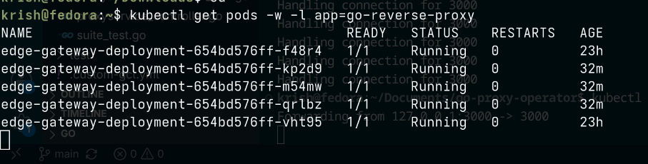
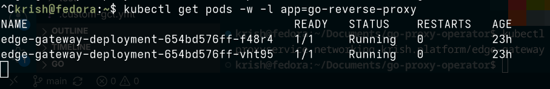

# go-proxy-operator


A Kubernetes Operator built with **Kubebuilder** and **controller-runtime** that manages the full lifecycle of [go-reverse-proxy](https://github.com/krishjj8/go-reverse-proxy) instances. Submit a single `ProxyService` custom resource; the operator provisions the Deployment, Service, and ConfigMap — and continuously heals any configuration drift.

---

## How it works

The operator implements the Kubernetes control-plane / data-plane split cleanly:

- **Control plane (this operator):** watches `ProxyService` resources and reconciles the required Kubernetes objects. It is completely unaware of live HTTP traffic.
- **Data plane (go-reverse-proxy):** runs independently, processing requests, routing via Host header, enforcing the circuit breaker and rate limiter. It has no knowledge of the operator loop.

```
ProxyService CR  ──▶  go-proxy-operator (reconciler)
                              │
              ┌───────────────┼───────────────┐
              ▼               ▼               ▼
          Deployment       Service        ConfigMap
              │
              ▼
      go-reverse-proxy pods
      (round-robin, circuit breaker, rate limiter)
```

Any manual edit to a managed resource (Deployment, Service, ConfigMap) is reverted on the next reconcile loop — the CR is the single source of truth.

---

## The ProxyService resource

```yaml
apiVersion: networking.krish.platform/v1alpha1
kind: ProxyService
metadata:
  name: edge-gateway
  namespace: default
  labels:
    app.kubernetes.io/name: go-proxy-operator
    app.kubernetes.io/managed-by: kustomize
spec:
  replicas: 2
  listenPort: 8080
  rateLimit: 25
  upstreams:
    - "payment-svc-stable:8001"
    - "payment-svc-canary:8001"
```

Applying this one file causes the operator to create and own:
- a `Deployment` running the proxy image
- a `ClusterIP` `Service` with a dynamically allocated virtual IP (never hardcoded)
- a `ConfigMap` containing the generated `config.yaml`

All three resources carry the label `proxy-instance: edge-gateway`, so you can query them together:

```bash
kubectl get deployments,services,configmaps -l proxy-instance=edge-gateway
```

---

## Local development

```bash
# Generate deepcopy hooks and CRD manifests from API types
make manifests

# Install the CRDs into the cluster
make install

# Verify
kubectl get crds | grep krish

# Run the controller loop locally (watches live cluster events)
make run
```

---

## Full demo (two-terminal split)

**Terminal 1 — operator**
```bash
cd ~/Documents/go-proxy-operator
make manifests && make install && make run
```

**Terminal 2 — data plane + traffic**
```bash
# Build and load the proxy image
cd ~/Documents/go-reverse-proxy
docker build -t go-reverse-proxy:latest .
kind load docker-image go-reverse-proxy:latest

# Apply backends and the ProxyService CR
kubectl apply -f backends.yaml
cd ~/Documents/go-proxy-operator
kubectl apply -f config/samples/networking_v1alpha1_proxyservice.yaml

# Confirm the operator created all three child resources
kubectl get deployments,services,configmaps -l proxy-instance=edge-gateway

# Open the tunnel
kubectl port-forward svc/edge-gateway-service 8080:8080

# Route a request through the proxy
curl -H "Host: api.proxy" http://localhost:8080/
```

---

## Experiments

### Experiment 1 — Declarative scaling via GitOps loop

**What it tests:** Kubernetes API extensibility and control-plane reconciliation.

Edit the `ProxyService` CR, bump `replicas` from `2` to `5`, and apply:

```bash
kubectl patch proxyservice edge-gateway --type=merge -p '{"spec":{"replicas":5}}'
# or edit config/samples/networking_v1alpha1_proxyservice.yaml and kubectl apply
```

The reconciler detects the spec delta at line `desiredReplicas != *existingDeployment.Spec.Replicas`, patches the Deployment, and three new proxy pods come up within seconds — no manual `kubectl scale` needed.

```bash
# Watch the pods appear in real time
kubectl get pods -w -l proxy-instance=edge-gateway
```

| Before | After |
|---|---|
| 2 pods Running | 5 pods Running (~47 s to Ready) |




---

## CI/CD

GitHub Actions on every push to `main` and every pull request. Uses `setup-envtest` to run controller tests against an isolated API server, then pushes the operator image to `ghcr.io`:

```yaml
name: Operator Control Plane Pipeline

on:
  push:
    branches: [ "main" ]
  pull_request:
    branches: [ "main" ]

env:
  REGISTRY: ghcr.io
  IMAGE_NAME: ${{ github.repository_owner }}/go-proxy-operator

jobs:
  validate-and-build-operator:
    runs-on: ubuntu-latest
    permissions:
      contents: read
      packages: write

    steps:
    - uses: actions/checkout@v4

    - uses: actions/setup-go@v5
      with:
        go-version: '1.26'
        cache: true

    - name: Verify dependencies
      run: go mod download && go mod verify

    - name: Check formatting
      run: |
        if [ -n "$(gofmt -l .)" ]; then
          echo "Files not formatted cleanly:"
          gofmt -l .
          exit 1
        fi

    - name: Run controller tests
      run: |
        go install sigs.k8s.io/controller-runtime/tools/setup-envtest@latest
        KUBEBUILDER_ASSETS=$(setup-envtest use 1.36.x -p path) go test -v ./...

    - uses: docker/setup-buildx-action@v3

    - uses: docker/login-action@v3
      with:
        registry: ${{ env.REGISTRY }}
        username: ${{ github.actor }}
        password: ${{ secrets.GITHUB_TOKEN }}

    - name: Extract image metadata
      id: meta
      uses: docker/metadata-action@v5
      with:
        images: ${{ env.REGISTRY }}/${{ env.IMAGE_NAME }}
        tags: |
          type=ref,event=branch
          type=sha,format=short
          latest

    - name: Build and push
      uses: docker/build-push-action@v6
      with:
        context: .
        push: ${{ github.event_name != 'pull_request' }}
        tags: ${{ steps.meta.outputs.tags }}
        labels: ${{ steps.meta.outputs.labels }}
        cache-from: type=gha
        cache-to: type=gha,mode=max
```

---

## Deploy to a cluster

```bash
# Build and push the operator image
make docker-build docker-push IMG=<your-registry>/go-proxy-operator:v1.0.0

# Deploy CRDs + controller
make deploy IMG=<your-registry>/go-proxy-operator:v1.0.0

# Or generate a single combined manifest
make build-installer IMG=<your-registry>/go-proxy-operator:v1.0.0
kubectl apply -f dist/install.yaml
```

---

## Key implementation notes

**Top-level ObjectMeta labels**
The label `proxy-instance: <name>` is set on the `ObjectMeta` of the Deployment, Service, and ConfigMap — not just inside the pod template or selector. Without this, `kubectl get -l proxy-instance=...` returns nothing, because the query matches resource metadata, not pod specs.

**Dynamic ClusterIP allocation**
The Service spec sets `Type: corev1.ServiceTypeClusterIP` but leaves the `ClusterIP` field empty. The API server assigns an available address from the cluster's Service CIDR at creation time. Hardcoding a static IP risks collisions and breaks portability across clusters.

---

## Cluster inspection

After deploying, audit the operator's dedicated namespace:

```bash
# Confirm the namespace exists
kubectl get ns | grep go-proxy-operator-system

# Check the manager pod is running
kubectl get pods -n go-proxy-operator-system

# Stream live reconciliation logs
kubectl logs deployment/go-proxy-operator-controller-manager \
  -n go-proxy-operator-system -c manager --tail=50
```

---

## Project layout

```
go-proxy-operator/
├── api/
│   └── v1alpha1/
│       └── proxyservice_types.go      # CRD schema and spec/status types
├── internal/
│   └── controller/
│       └── proxyservice_controller.go # reconcile loop + child resource factories
├── config/
│   ├── crd/                           # generated CRD manifests
│   ├── manager/                       # controller-manager deployment
│   ├── rbac/                          # ClusterRole / binding
│   └── samples/                       # example ProxyService CR
├── images/                            # experiment telemetry screenshots (exp1)
└── Makefile
```

---

## Contributing

1. Edit the API types in `api/v1alpha1/proxyservice_types.go`.
2. Update reconciliation logic in `internal/controller/proxyservice_controller.go`.
3. Regenerate manifests and tidy deps:

```bash
make manifests
go mod tidy
```

---

## Prerequisites

- Go 1.26+
- Docker or Podman
- kind cluster with Cilium installed (see [go-reverse-proxy](https://github.com/krishjj8/go-reverse-proxy) setup)
- kubectl + Kustomize

---

## License

Apache 2.0
